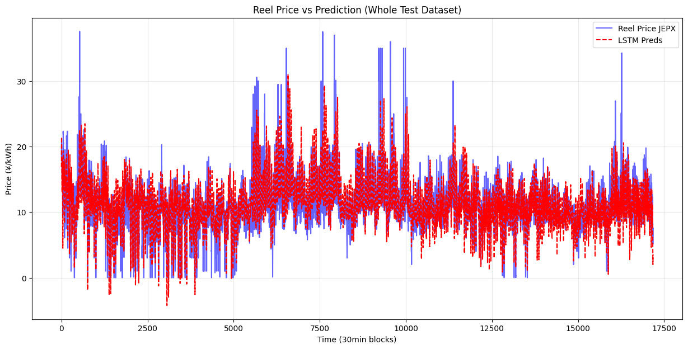

# JEPX Day-Ahead Electricity Price Forecasting

Forecasting Japan's day-ahead wholesale electricity price (JEPX), combining rigorous
time-series diagnostics with deep learning and real satellite-adjacent weather data
across Japan's 9 pricing regions.

## Why this project

Japan's electricity market is driven by solar generation, regional demand, and
weather — the same class of physical, alternative-data-driven signal used in energy
forecasting more broadly. This project builds the full pipeline end to end: raw
market data -> statistical characterization -> leakage-safe feature engineering ->
deep learning forecasters -> exogenous weather features.

## Methodology

- **Stationarity**: Augmented Dickey-Fuller tests show the raw `System price` series
  is already stationary (ADF statistic -106.82, p ~ 0.0), as are log-price,
  difference, and log-return transforms.
- **Seasonality**: ACF/PACF analysis identifies a clear 48-block (one full day)
  cycle, with direct partial autocorrelation at lags 1, 2, and 48 — 30 minutes,
  1 hour, and 24 hours back all carry information.
- **Residual structure**: after removing the 48-block seasonal component, a
  Ljung-Box test on the residuals rejects white noise (statistic 548.82,
  p ~ 1.6e-111) — the seasonal pattern alone doesn't explain the price, motivating
  the addition of exogenous (weather) features.
- **Data leakage discipline**: JEPX is a day-ahead market — auctions for day J close
  at 10:00 on day J-1 — so every price-derived feature is shifted by 48 blocks
  (one full day) before being used to predict day J.

## Models

Both forecasters use a 48-step (1-day) context window to predict the next 30-minute
block:

- **Feedforward NN**: converges to a train MAE of 0.183 and test MAE of 0.131
  (scaled units) after 100 epochs.
- **LSTM** (hidden size 512, 3 layers): trained for 1000 epochs; see
  `docs/images/lstm_prediction_vs_actual.png` below for its out-of-sample fit.

## Weather extension

Real and forecast weather (cloud cover, wind, temperature, radiation, humidity) is
pulled from Open-Meteo for the city nearest each of JEPX's 9 pricing regions, at
30-minute resolution. Two feeds are built deliberately differently:

- **Forecast feed**: the same-day (00:00) forecast run, used as-is.
- **Real-weather feed**: true observed weather, shifted by 24h so the model only
  sees weather it could plausibly have known about.

This project explicitly documents a subtler look-ahead-bias tradeoff: the 00:00
forecast run isn't exactly what a trader would have seen at the 10:00-the-day-before
auction cutoff, since a high-resolution archive of forecasts-as-issued isn't
available for free. The 00:00 run is used as a reasonable proxy, since forecast
skill at a ~24h vs. ~38h horizon is statistically close, and the alternative would
break the physical link between same-day weather and same-day price that the model
needs to learn.

## Data

`JEPX_DayAheadMarket.csv` is not included (Kaggle dataset,
`jepx-dayaheadmarket`). Weather data is fetched live from the public
[Open-Meteo](https://open-meteo.com/) API — no API key required.

## How to run

Open `jepx_price_forecasting.ipynb`; requires `pandas`, `numpy`, `torch`,
`statsmodels`, `scikit-learn`, `openmeteo-requests`, `requests-cache`,
`retry-requests`.

## Future work

Open questions from the notebook's own analysis:

- Whether to feed raw weather data directly, or first train a dedicated weather
  forecaster and use its output as a feature (two-stage modeling).
- Whether to target the day-ahead market (better statistical properties, but
  requires predicting a full day — 48 blocks — at once) or the noisier intraday
  market.
